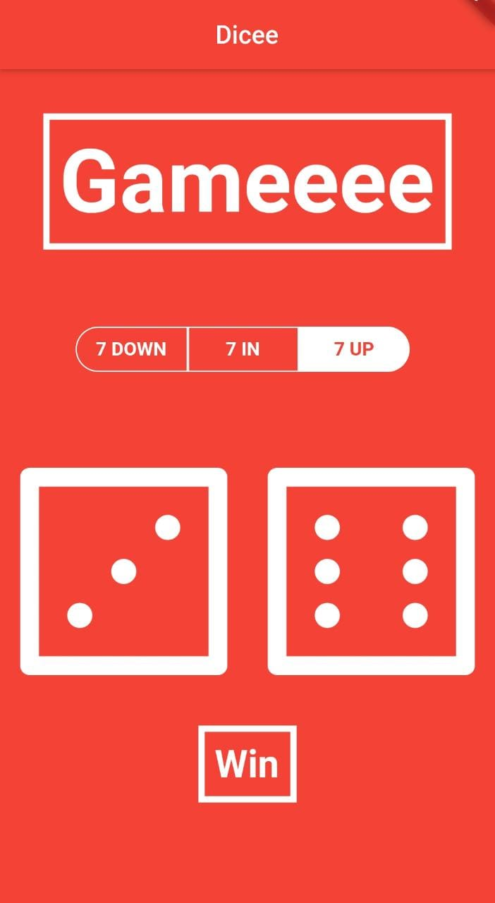
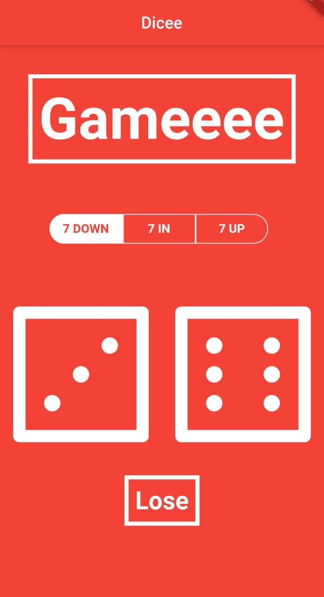

# 7-up-or-down-Game

It's a simple game(flutter demo project) which has a custom switch and a recycling dual dice and asks to try out your luck if the sum of the numbers of the 2 dices shown is 7 in, 7 in or 7 up .

## App Icon :- 

## App images and working :- 

 

Clicking on the any one of the dice will have a random spin of both the die and based on what option you selected (i.e. 7 up,7 in or 7 down), will give you your result whether you 'WON' or 'LOST'
